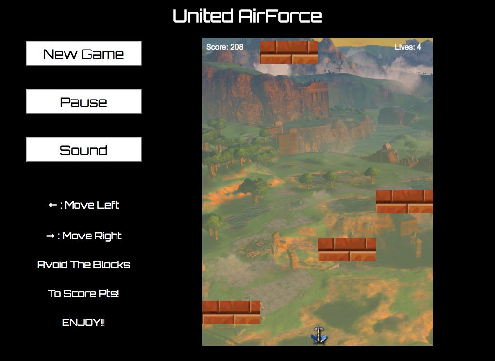

# United AirForce

## Background
Unitd AirForce is a lite variation of "vertical" scrolling arcade games. This version will include a jet (user controlled object), and randomly falling obstacles which the user's reflexes. As the game progresses, obstacle evasion will gradually become more difficult by increasing the speed at which the obstacles occurs. Scoring is based upon the length of time the user is able to avoid the obstacles.

## How To Play

+ Press `New Game`: To start a fresh game.
+ Press `Pause`: To pause game.
+ Press `Sound`: For background music.
+ Press `Left Arrow`: To move left.
+ Press `Right Arrow`: To move right.
+ Avoid blocks to score points. Last as long as you can!

## Technology

## Future Plans
+ Add jet ability to shoot projectiles and destroy bricks.
+ Add options for increasing number of bricks.
+ Options for different obstacle display.
