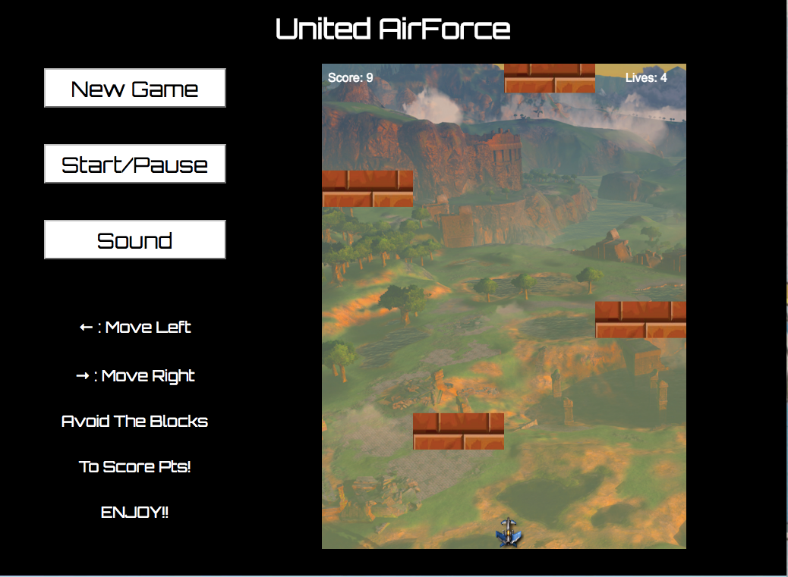

# United AirForce

## Background
Unitd AirForce is a lite variation of "vertical" scrolling arcade games. This version will include a jet (user controlled object), and randomly falling obstacles which the user's reflexes. As the game progresses, obstacle evasion will gradually become more difficult by increasing the speed at which the obstacles occurs. Scoring is based upon the length of time the user is able to avoid the obstacles.

## How To Play

+ Press `New Game`: To start a fresh game.
+ Press `Start/Pause`: To pause

## Future Plans
